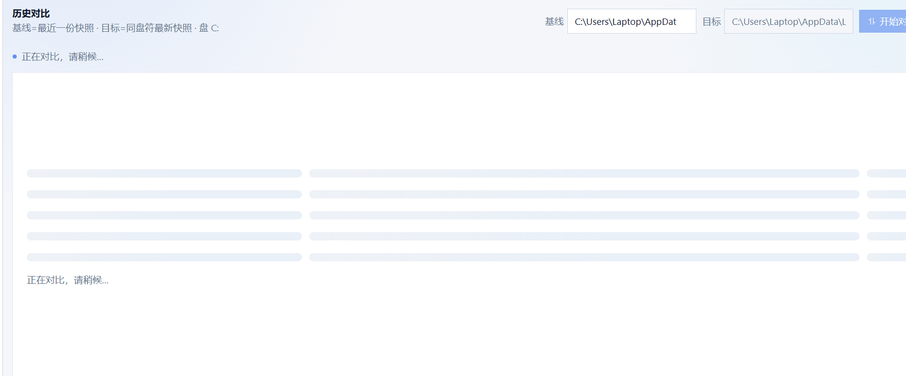
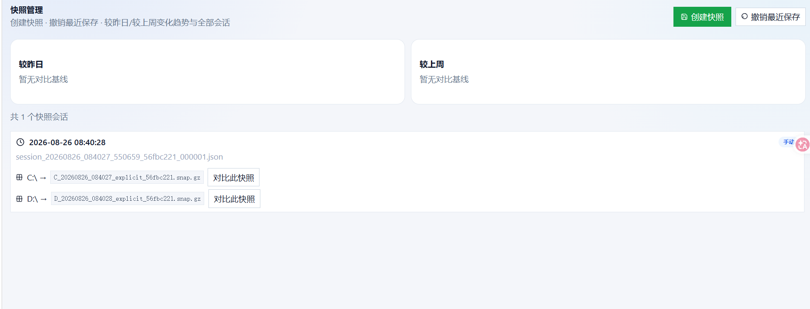
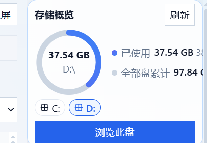
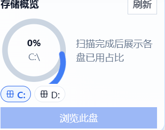
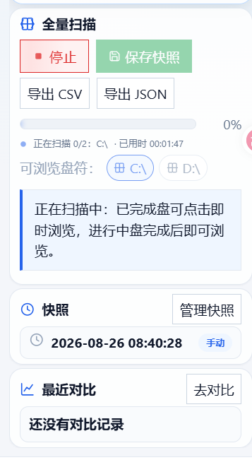
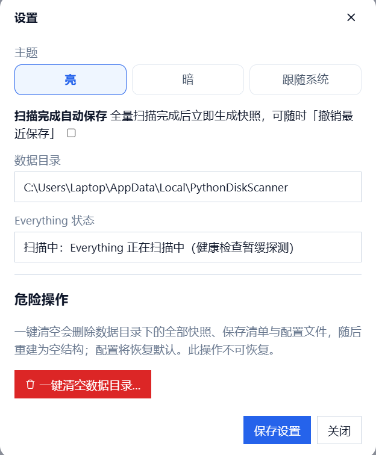
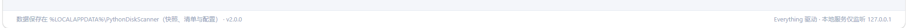

# 问题说明

1.对比功能不可用，点进去一直显示正在对比，请稍候

2.如果工作台打开了矩形图，当切换为排行或者表格时，底层依然会出现矩形图的渲染效果删过
3.管理快照的地方没有删除指定快照的功能

4.不知道什么原因，较昨日，较上周没有任何显示，不确定是不是功能没有实现，还是别的原因，而且显示效果不知道和不和对比页面的显示一样

5.打开页面后直接自动触发全量扫描吧，因为要保存快照还是会自动扫描，同时扫描完自动保存快照吧，相应的界面按钮元素可以移掉了。

6.在扫描时这个动画有点奇怪，动画中间部分有点奇怪，可见下图image-20260902154955413

7.全量扫描一次后第二次，迟迟扫描迟迟没有结果

8.没有关系目录的功能

9.停止扫描没有反馈，但是一段时间后确实会停止扫描

10.以下部分略显拥挤，而且对照和最近对比在上面是有入口的。正在扫描0/2这样并不能看出扫描进度和时间，也没有预计完成时间，不够友好。

11.但切换明暗主题时，最初没什么问题，但是当动画扩散最下端接触到底部时，两侧会瞬间铺满

12.排行和表格的显示效果大差不差，舒适列表和紧凑列表，没什么太大的区别

13.但我第二次全量扫描中途停止后，虽然还是显示**来自内存缓存（无需重新扫描）**，而且总感觉全量扫描和扫描之间有冲突

14.到处csv到处json不可用，测试输出均为{"error":"\u6682\u65e0\u53ef\u5bfc\u51fa\u7684\u5168\u91cf\u626b\u63cf\u7ed3\u679c\uff0c\u8bf7\u5148\u5b8c\u6210\u5168\u91cf\u626b\u63cf","ok":false}

15.设置排版需要对齐，一键清空目录和右侧按钮没有对整齐。在设置切换主题时，扩散的中心并不是鼠标点击位置，界面点击主题进行切换时，感觉扩散中心也不是鼠标点击位置

16.后台会触发如下日志，不知道是否正常/api/fullscan/status。

127.0.0.1 - - [02/Sep/2026 16:12:19] "GET /api/fullscan/status HTTP/1.1" 200 -
127.0.0.1 - - [02/Sep/2026 16:12:20] "GET /api/fullscan/status HTTP/1.1" 200 -
127.0.0.1 - - [02/Sep/2026 16:12:21] "GET /api/fullscan/status HTTP/1.1" 200 -
127.0.0.1 - - [02/Sep/2026 16:12:23] "GET /api/fullscan/status HTTP/1.1" 200 -
127.0.0.1 - - [02/Sep/2026 16:12:24] "GET /api/fullscan/status HTTP/1.1" 200 -
127.0.0.1 - - [02/Sep/2026 16:12:25] "GET /api/fullscan/status HTTP/1.1" 200 -
127.0.0.1 - - [02/Sep/2026 16:12:27] "GET /api/fullscan/status HTTP/1.1" 200 -
127.0.0.1 - - [02/Sep/2026 16:12:28] "GET /api/fullscan/status HTTP/1.1" 200 -
127.0.0.1 - - [02/Sep/2026 16:12:29] "GET /api/fullscan/status HTTP/1.1" 200 -
127.0.0.1 - - [02/Sep/2026 16:12:31] "GET /api/fullscan/status HTTP/1.1" 200 -
127.0.0.1 - - [02/Sep/2026 16:12:31] "GET /api/health HTTP/1.1" 200 -

17.不知道怎么点击后everything那个会一直显示扫描中。

18.主题和使用指引中间的按钮点击无反应，不知道是由有用

19.以下内容不知道是否会根据实际配置进行调整，但我更希望删掉他

20.感觉资源的缓存有点问题，请监测确认一下。

21.程序运行起来后，会有如下输出，感觉在web方案中可以过滤掉，这是之前cli方案的输出

D:\deepseek\python-disk-analyzer>python app.py
🧭 正在检查 Everything 运行环境，配置文件: C:\Users\Laptop\AppData\Local\PythonDiskScanner\config.json
 * Serving Flask app 'app'
 * Debug mode: off
WARNING: This is a development server. Do not use it in a production deployment. Use a production WSGI server instead.
 * Running on http://127.0.0.1:5000
Press CTRL+C to quit
🔎 正在按 Python 架构选择 Everything SDK DLL: Everything64.dll
🔌 SDK DLL 已就绪: D:\deepseek\python-disk-analyzer\everything-SDK\dll\Everything64.dll
🔎 正在检查 Everything 进程和数据库状态...
✅ Everything 已运行，IPC 和数据库均已就绪。
127.0.0.1 - - [02/Sep/2026 15:39:45] "GET / HTTP/1.1" 200 -
127.0.0.1 - - [02/Sep/2026 15:39:46] "GET /static/css/style.css HTTP/1.1" 200 -
127.0.0.1 - - [02/Sep/2026 15:39:46] "GET /static/css/tokens.css HTTP/1.1" 200 -